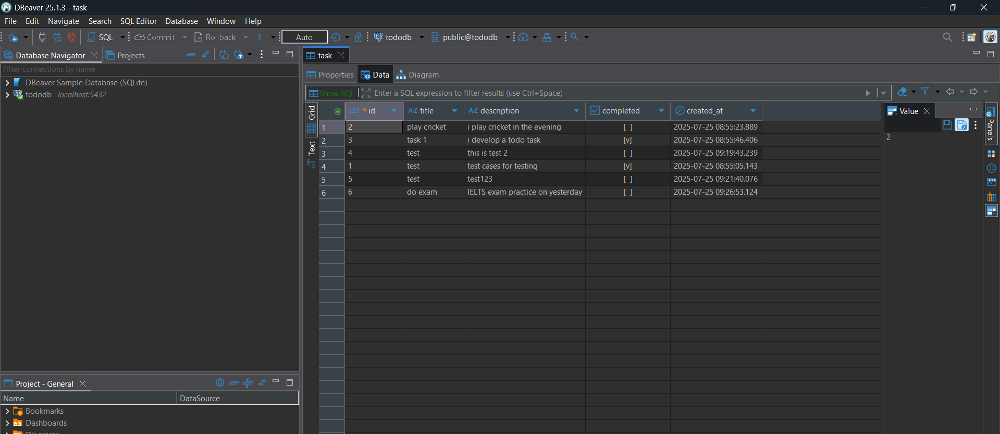
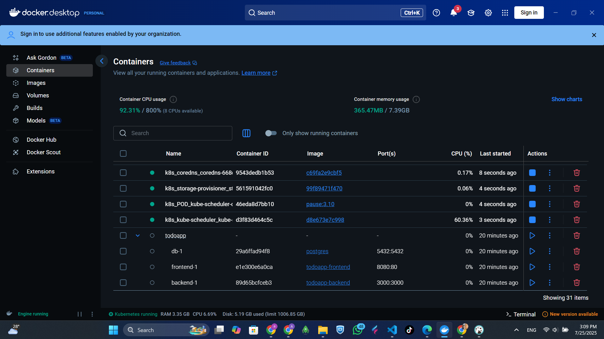
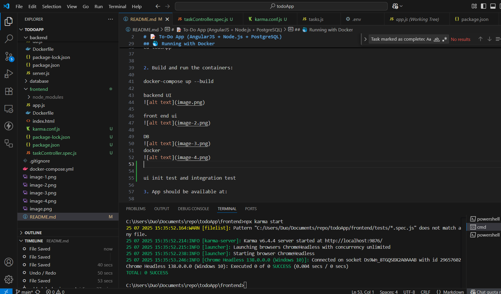

To-Do App (AngularJS + Node.js + PostgreSQL)
Tech Stack

- Frontend: AngularJS, Bootstrap
- Backend: Node.js + Express
- Database: PostgreSQL
- Testing: Jest, Supertest (backend), Karma + Jasmine (frontend)
- Dockerized: Uses Docker and docker-compose

---

Features

- Add new to-do tasks (title + description)
- Display latest 5 uncompleted tasks
- Mark tasks as done (they disappear from the list)
- RESTful API
- Unit & Integration tests
- Docker support for full stack

---

Running with Docker

Make sure Docker and docker-compose are installed.

1. Clone the repo:

git clone 
cd todoApp

2. Build and run the containers:

docker-compose up --build

backend UI

front end ui

DB 

docker

ui unit test and integration test

3. App available at:

- Frontend: http://localhost:8080  
- Backend API: http://localhost:3000/api/tasks  
- PostgreSQL: port 5432

---

Running Tests

Backend Tests (Node + Express):

From the backend folder:

cd backend
npm install
npm test

Frontend Tests (AngularJS):

From the frontend folder:

cd frontend
npm install
npm init -y
npm install --save-dev karma karma-jasmine jasmine-core karma-chrome-launcher angular-mocks
npm install angular angular-mocks --save-dev
npx karma start

Database Schema

Table: task

