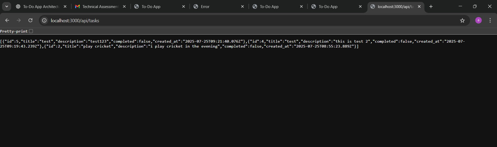
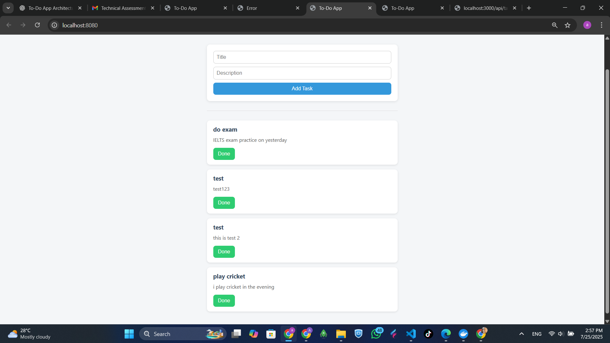

# 📝 To-Do App (AngularJS + Node.js + PostgreSQL)

A simple full-stack to-do task management app. Users can add tasks, view the latest 5 uncompleted tasks, and mark them as done.

---

## 📦 Tech Stack

- Frontend: AngularJS, Bootstrap
- Backend: Node.js + Express
- Database: PostgreSQL
- Testing: Jest, Supertest (backend), Karma + Jasmine (frontend)
- Dockerized: Uses Docker and docker-compose

---

## 🚀 Features

- Add new to-do tasks (title + description)
- Display latest 5 uncompleted tasks
- Mark tasks as done (they disappear from the list)
- RESTful API
- Unit & Integration tests
- Docker support for full stack

---

## 🐳 Running with Docker

Make sure Docker and docker-compose are installed.

1. Clone the repo:

git clone https://github.com/your-username/todoApp.git
cd todoApp


2. Build and run the containers:

docker-compose up --build

backend


front end ui


3. App should be available at:

- Frontend: http://localhost:8080  
- Backend API: http://localhost:3000/api/tasks  
- PostgreSQL: port 5432

---

## 🧪 Running Tests

🟦 Backend Tests (Node + Express):

From the backend folder:

cd backend
npm install
npm test


🟨 Frontend Tests (AngularJS):

From the frontend folder:

cd frontend
npm install


## 🗄 Database Schema

Table: task

| Column      | Type      | Description              |
|-------------|-----------|--------------------------|
| id          | SERIAL    | Primary key              |
| title       | TEXT      | Task title (required)    |
| description | TEXT      | Optional task description|
| completed   | BOOLEAN   | true if task is done     |
| created_at  | TIMESTAMP | Auto-generated timestamp |

---

## 📁 Project Structure

```
todoApp/
│
├── backend/          # Node.js + Express API
│   ├── routes/
│   ├── controllers/
│   ├── db.js
│   ├── app.js
│   ├── server.js
│   ├── tests/
│
├── frontend/         # AngularJS SPA
│   ├── app.js
│   ├── index.html
│   ├── tests/
│
├── docker-compose.yml
├── README.md
```

---

## 🧼 Clean Code & SOLID Principles

- Routes, controllers, and services are separated
- Error handling and status codes are managed properly
- Functions have single responsibility
- Testing ensures correct behavior

---

## 🏁 Extra

✔ Pretty UI using Bootstrap  
✔ End-to-End test ready (can integrate Cypress or Playwright later)  
✔ Code coverage supported (via jest --coverage)

---

Feel free to fork or contribute! 🎯
